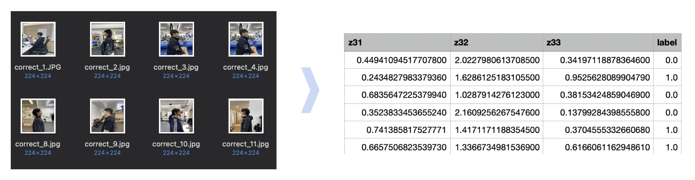
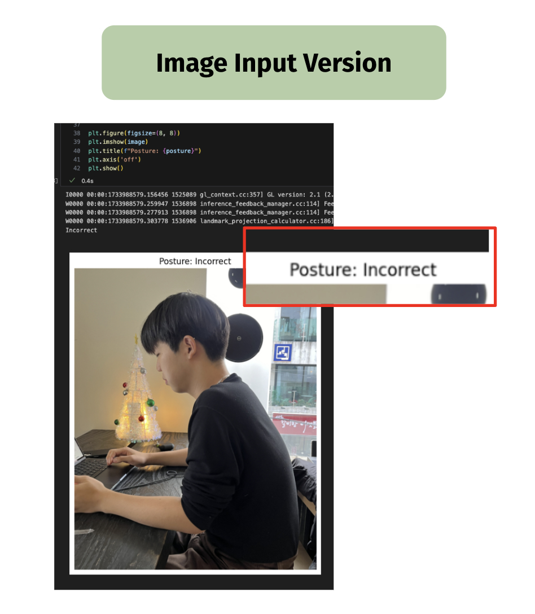
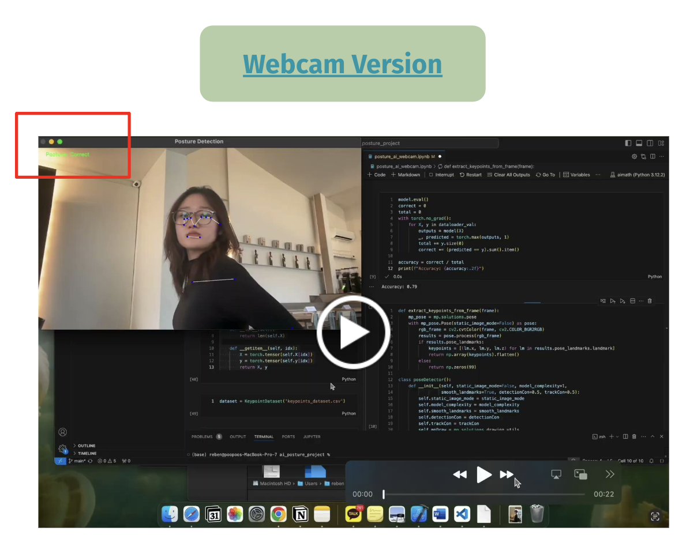

# AI System for Detecting Forward Head Posture (Tech Neck)

📅 December 22, 2024

## 🧩 Problem Overview

Modern lifestyles involve excessive screen time, often over 6 hours daily. Poor sitting posture, especially **Forward Head Posture (FHP)**—commonly known as "tech neck"—can lead to serious musculoskeletal issues. However, most individuals are unaware of their poor posture and lack tools to correct it.

## 🎯 Project Goal

To develop an **AI-based real-time system** that identifies poor posture using webcam or image input and provides immediate feedback. This binary classification system distinguishes between:

- ✅ Correct Posture  
- ❌ Incorrect Posture

## 🔍 Approach

- **Pose Estimation**: Used **MediaPipe** to extract 33 key body landmarks from input images or webcam frames.
- **Custom Dataset**: Built a dataset of 136 labeled images (augmented to balance classes), with 80/20 train-validation split.
  
- **Model Architecture**:  
  - 3-layer Fully Connected Neural Network (FCNN)  
  - ReLU activation + Dropout (0.5)  
  - Final output: Correct / Incorrect
- **Training**:  
  - Loss Function: `CrossEntropyLoss`  
  - Optimizer: `Adam`  
  - Learning Rate: 0.0001  
  - Epochs: 2000  
  - Final accuracy: **83% on validation set**

## 🖥️ Demo

### Image-based posture detection:

### Real-time webcam system:

## 📊 Results

- Training Loss decreased from 2.78 to 0.40  
- Final Validation Accuracy: **83%**  
- Issues like overfitting and small dataset size were partially mitigated through:
  - Data augmentation
  - Hyperparameter tuning

## 🔗 Resources

- 💻 [GitHub Repo](https://github.com/becanam/ai_posture_project.git)  
- 🎥 [Webcam Test Video](https://drive.google.com/file/d/1xR1xckMN5vIsSMEHdfrBN5_P1l0fcorB/view?usp=drive_link)
